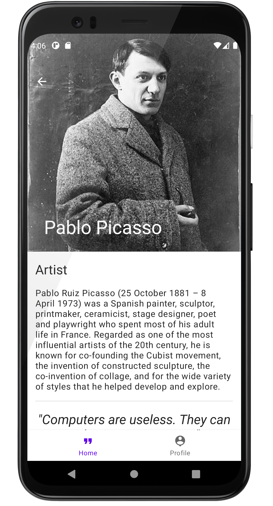
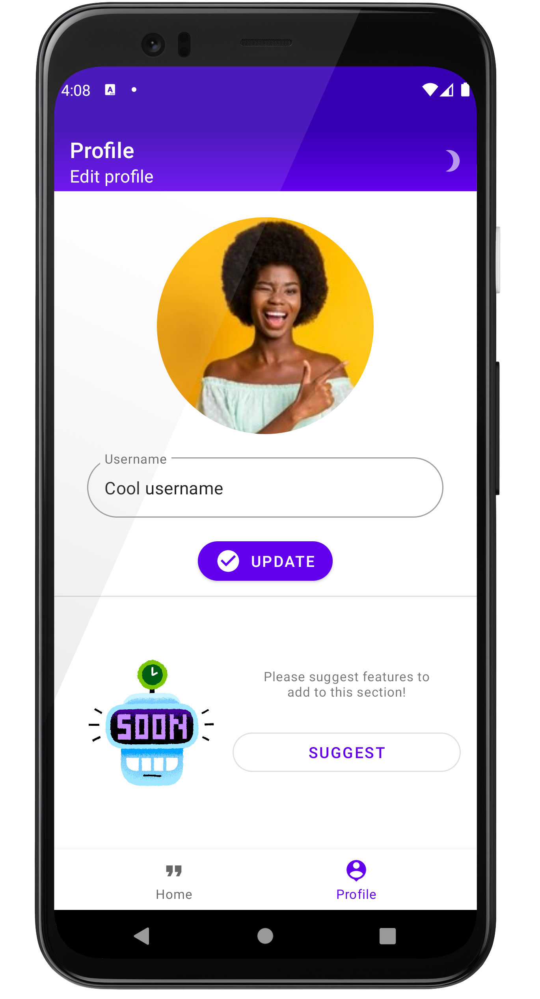
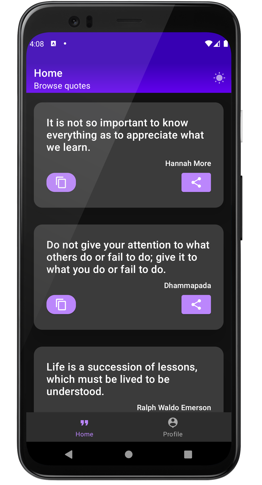

# Quoter
Browse &amp; copy quotes to share among your socials!

 

#### Features
📸  Upload profile picture & change username  
©️  Copy quotes  
🖊️ View quote details including author detail & image  
🌗   Dark mode  

### Current release (Alpha v0.1.0)
Currently, share feature is not enabled. To try the app, you can download the APK that's attached in the artifacts with the release. However if you're looking to help me out regarding feedback or PR's, kindly mail me at the id mentioned below and I'll add you to my testers group for early feedback & tests!

 Please share your feedback regarding the app at: adhikaridayamoy@gmail.com.
