  

A minimalist Android quotes app for offline reading, saved favourites, daily
reminders and on-device listening. Browse by topic, search words or authors, and
share an attributed quote image. On supported unfolded and tablet layouts, keep
Browse or Settings beside the reader.

#### Screenshots

<!-- QUOTER-SCREENSHOTS:START -->
<p>
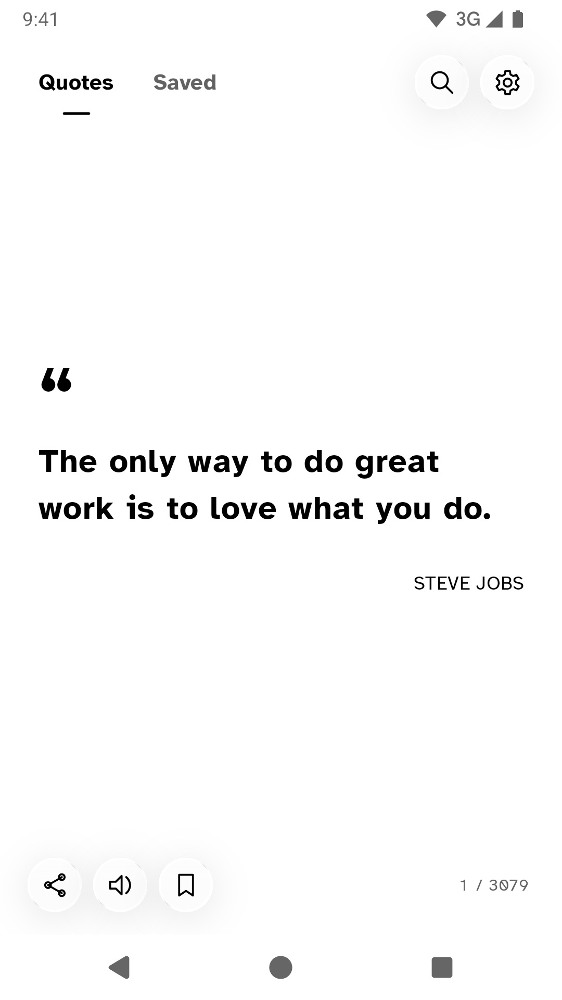
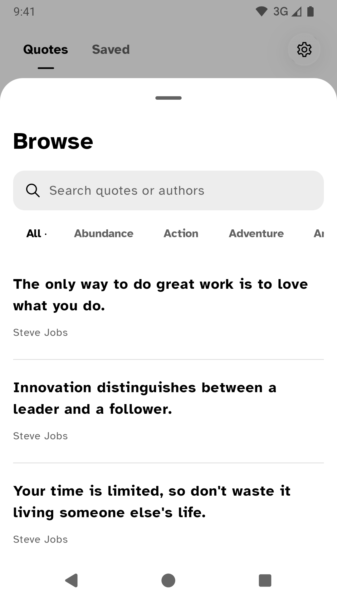
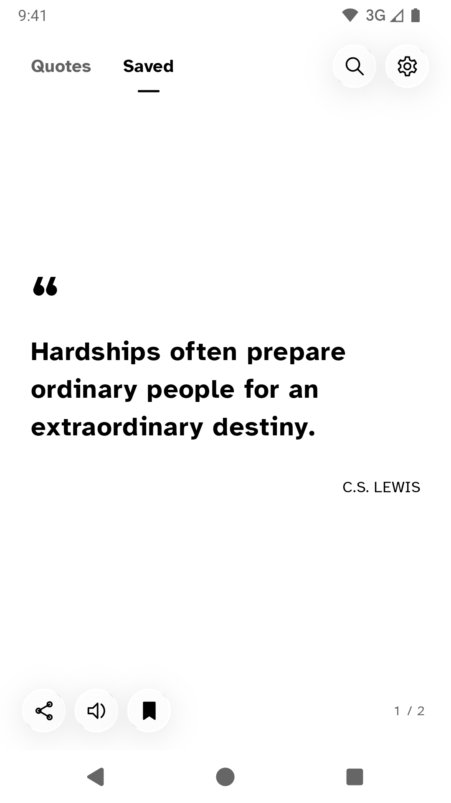
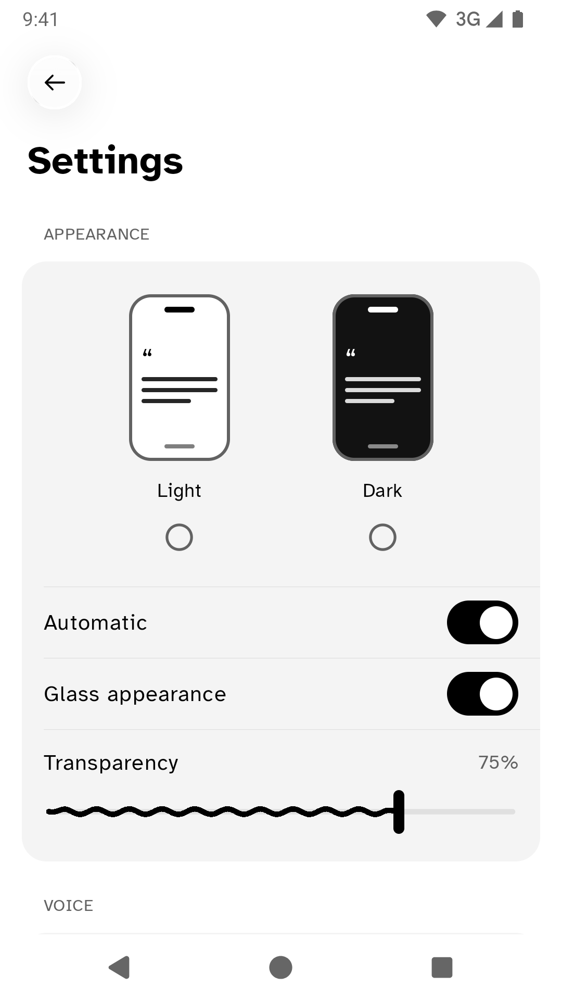
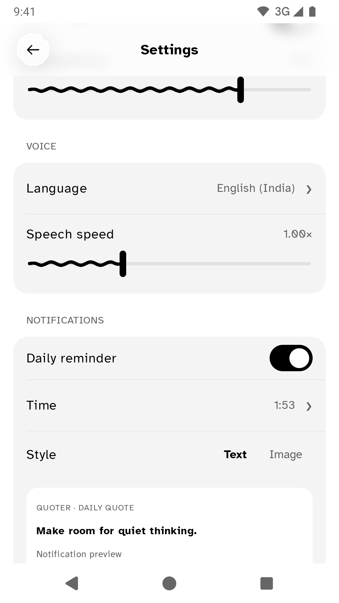
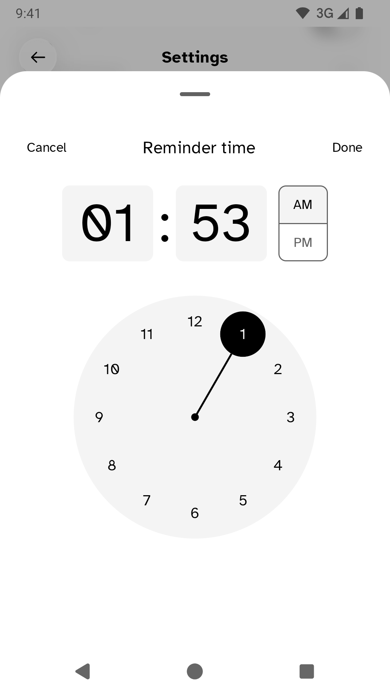
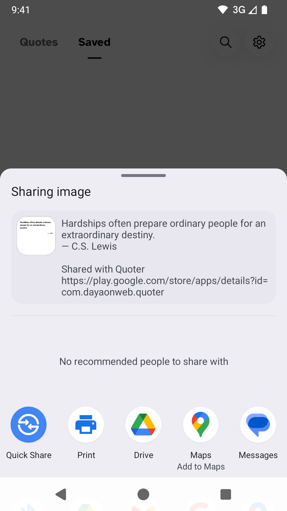
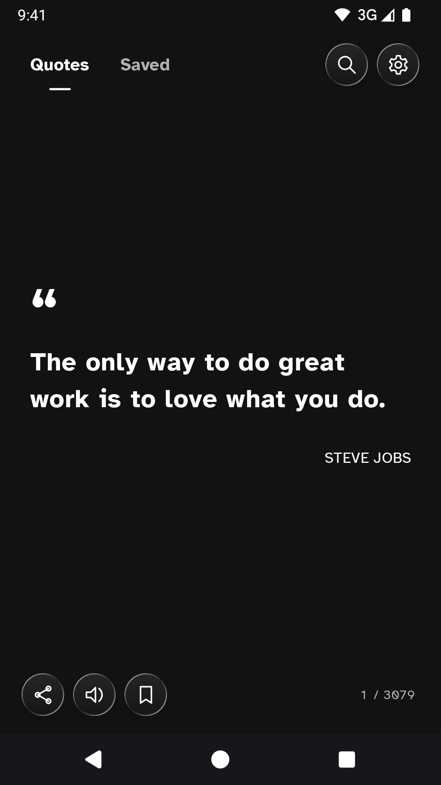
</p>
<p>
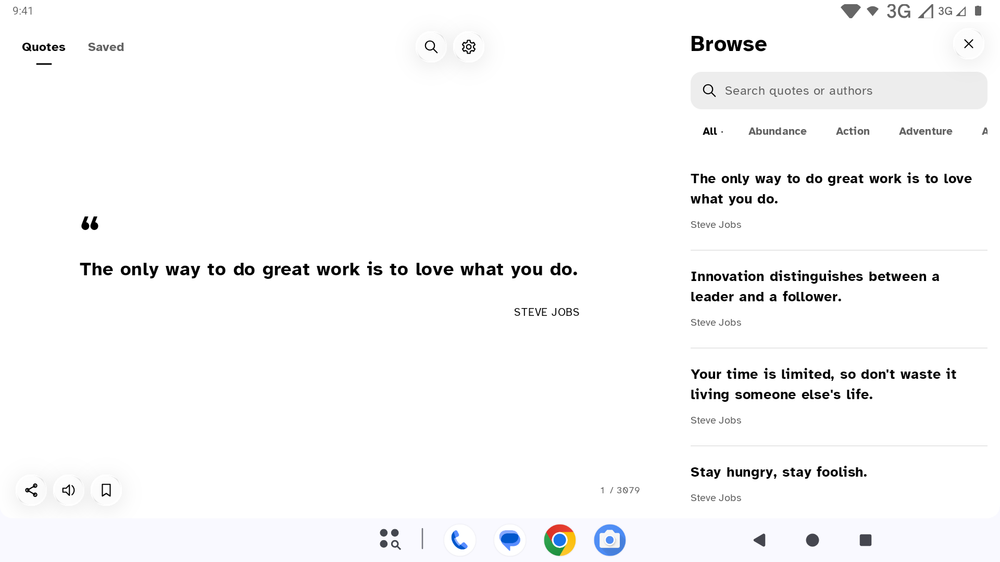
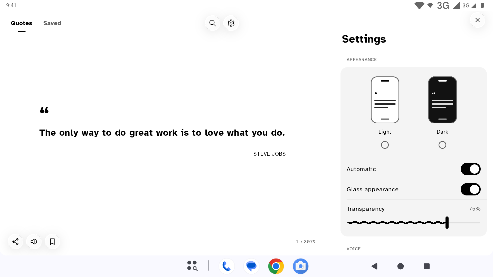
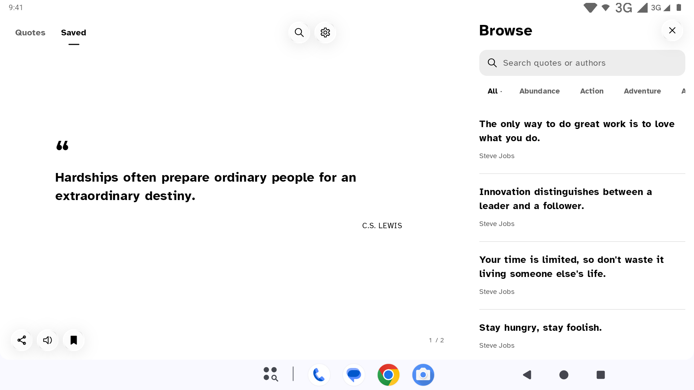
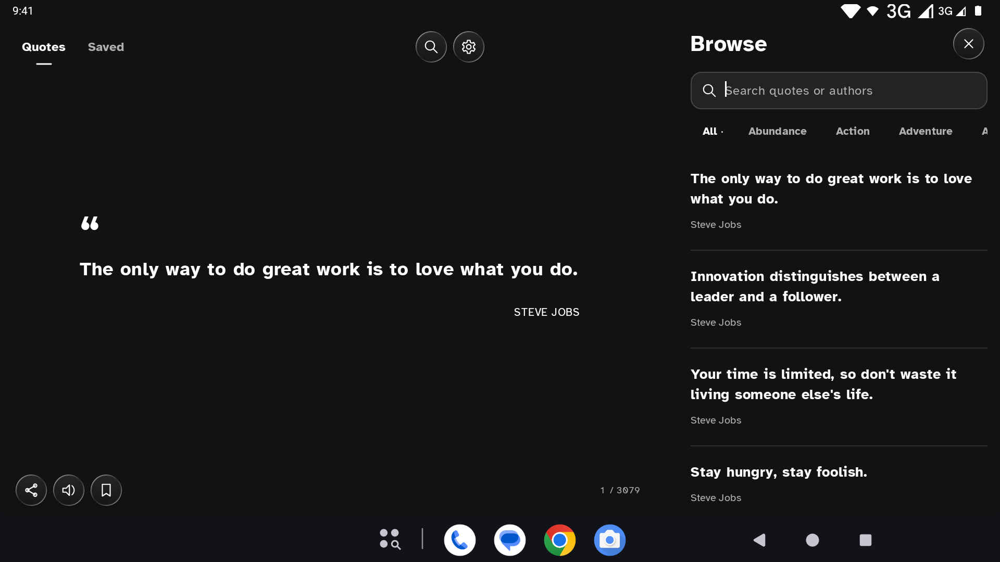
</p>
<!-- QUOTER-SCREENSHOTS:END -->

#### Features

- Read the bundled quote collection offline; search words, authors and topics.
- Save favourites with a separate reading position.
- Listen using compatible installed offline voices and adjust speech speed.
- Share a quote image with its author and attributed text through Android's chooser.
- Set daily reminders with text or image-style notifications.
- Choose Light, Dark or Automatic appearance, with optional adjustable glass controls.
- Open Browse or Settings beside the quote on supported large and unfolded screens.

The gallery shows version 4.00.00 on the retained phone/unfolded emulator. The
same image files are prepared for the next Play listing update. See
[the ASO and media plan](play-store/ASO-RESEARCH.md).

Download the signed APK, Play bundle, crash mapping and checksums from
[Quoter 4.00.00](https://github.com/Damercy/Quoter/releases/tag/v4.00.00).
The GitHub APK cannot update an existing Play-installed copy because Google uses
a different app signing certificate. The Play Store update is pending.

<p float="left">
<a href='https://play.google.com/store/apps/details?id=com.dayaonweb.quoter&pcampaignid=pcampaignidMKT-Other-global-all-co-prtnr-py-PartBadge-Mar2515-1'></a>
 </p>

Share feedback at: adhikaridayamoy@gmail.com.

## Development

See [CHANGELOG](CHANGELOG.md) for versioned changes. The reader uses Compose, bundled offline quotes, optional
static data refresh, saved quotes and the device's text-to-speech engine.

Clone this existing repository and install JDK 17 or newer, the Android SDK
(platform 37 and the required build tools), and the official Android CLI.
Set `JAVA_HOME` and `ANDROID_HOME` for your machine, then use the included Gradle
wrapper; no global Gradle installation is needed.

```powershell
git clone https://github.com/Damercy/Quoter.git
cd Quoter
android info
./gradlew.bat :app:assembleDebug :app:testDebugUnitTest :app:lintDebug
```

On macOS/Linux use `./gradlew` (make it executable if necessary). Read
[AGENTS.md](AGENTS.md) before changing the app. The Android CLI handles supported
SDK/device workflows; Gradle builds and verifies the project. Release credentials
are optional for development and are supplied privately for publishing.

## Releases from chat

When the owner confirms the final reviewed release, the local release client
updates this repository, creates an annotated version tag and GitHub release,
and submits the same signed bundle plus reviewed store images/descriptions to
Google Play. The README and versioned release notes are reviewed before that
confirmation. Google controls review and when the Play update becomes public.
An explicitly requested GitHub-only release uses `--github-only` and publishes
code, tag and assets without submitting a Play edit.

See [the release workflow](audit/RELEASE-WORKFLOW.md) and
[Play setup](audit/PLAY-PUBLISHING-SETUP.md) for commands and recovery details.
Cloning includes source and tooling; publishing on another machine additionally
requires secure signing/Play credentials and GitHub authentication.
