<p align="center"><strong>Quoter</strong> — a minimalist Android app for reading, saving and listening to quotes.</p>
<p align="center">
  <a href="https://play.google.com/store/apps/details?id=com.dayaonweb.quoter">Google Play</a> ·
  <a href="https://github.com/Damercy/Quoter/releases/latest">Download APK</a> ·
  <a href="CHANGELOG.md">Changelog</a> ·
  <a href="https://github.com/Damercy/Quoter/actions/workflows/android.yml">CI</a>
</p>

Read offline, browse topics and authors, save favourites, listen with installed
on-device voices, set daily reminders and share attributed quote images.
Monochrome Light/Dark themes, adjustable glass and supporting panes adapt the
reader to phone, tablet and unfolded windows.

## Screenshots

<!-- QUOTER-SCREENSHOTS:START -->
<table>
<tr>
<td align="center"><a href="play-store/screenshots/phone/01-reader.png">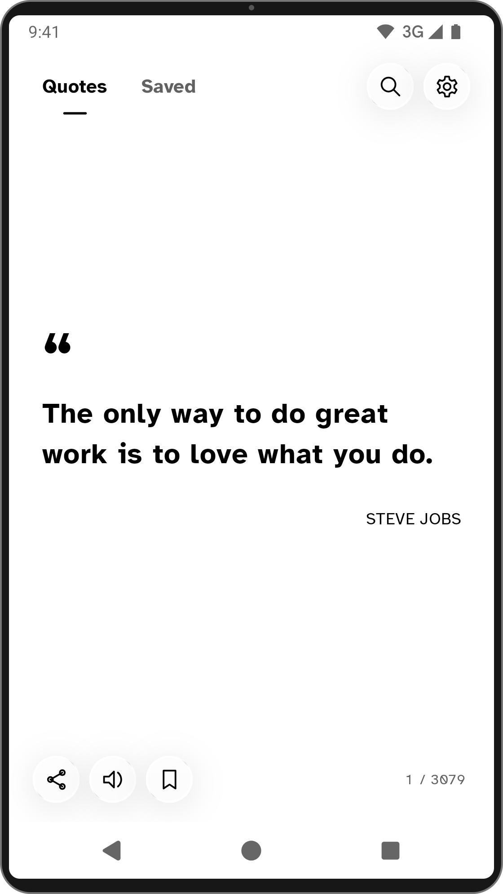</a><br/><sub>Reader</sub></td>
<td align="center"><a href="play-store/screenshots/phone/02-browse.png">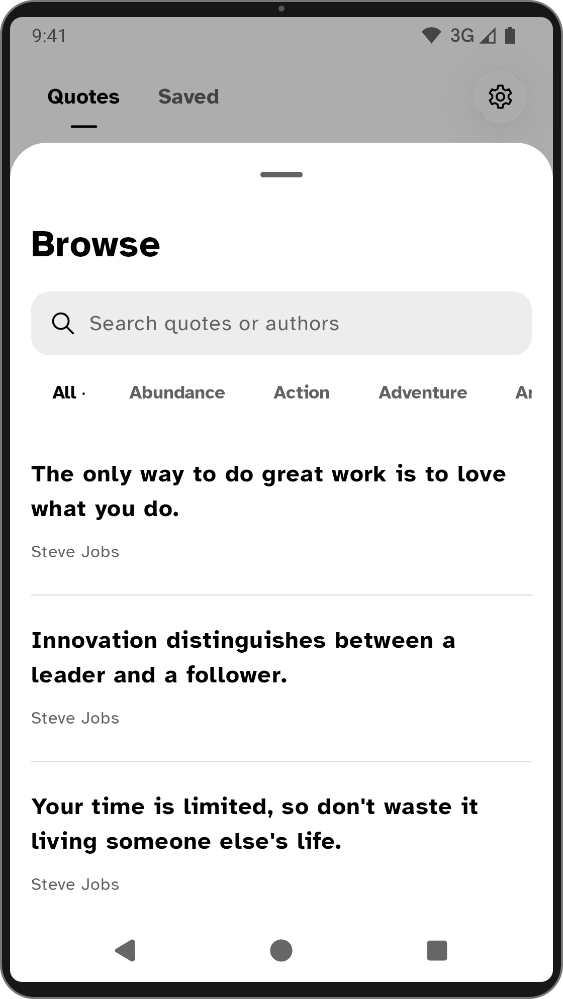</a><br/><sub>Browse</sub></td>
<td align="center"><a href="play-store/screenshots/phone/03-saved.png">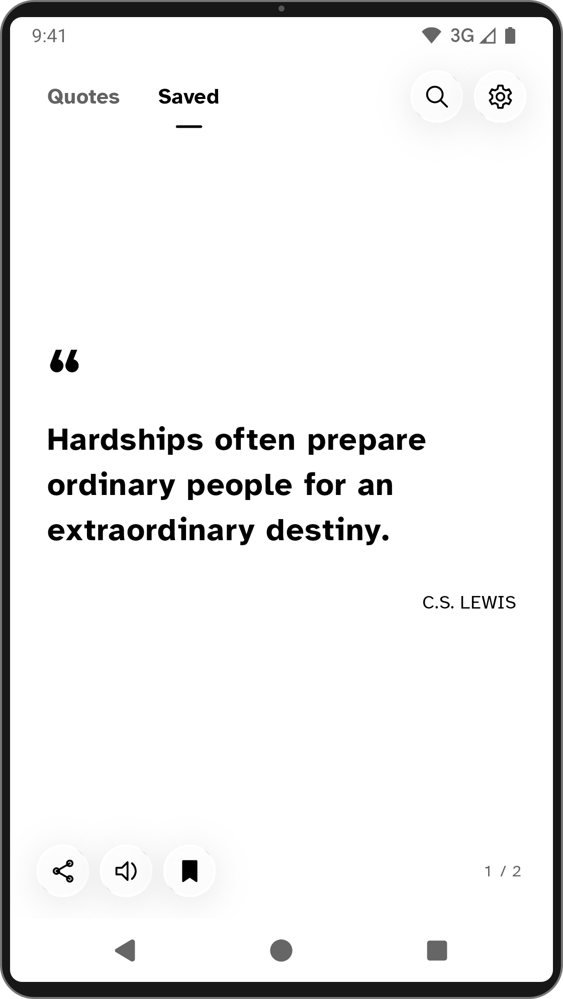</a><br/><sub>Saved</sub></td>
<td align="center"><a href="play-store/screenshots/phone/04-appearance.png">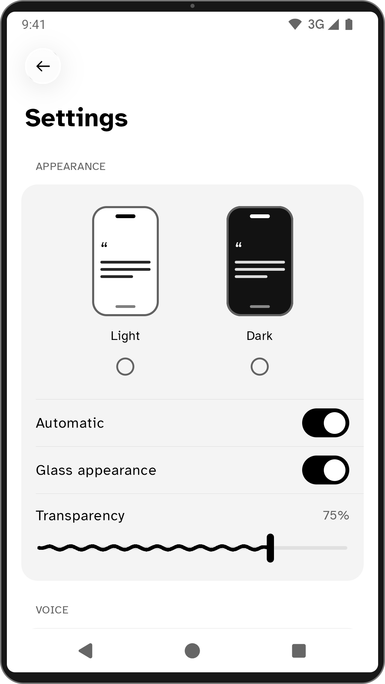</a><br/><sub>Appearance</sub></td>
</tr>
</table>

<details>
<summary>Voice, reminders, sharing and dark mode</summary>

<table>
<tr>
<td align="center"><a href="play-store/screenshots/phone/05-voice-and-reminders.png">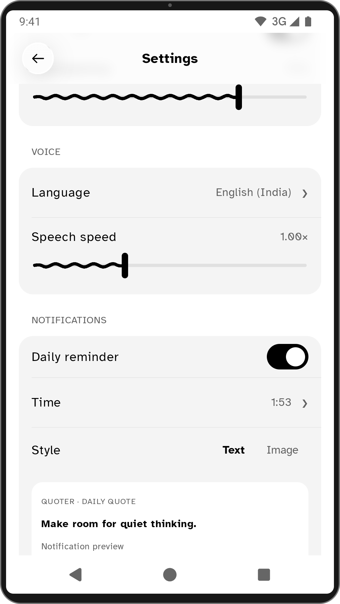</a><br/><sub>Voice and reminders</sub></td>
<td align="center"><a href="play-store/screenshots/phone/06-reminder-clock.png">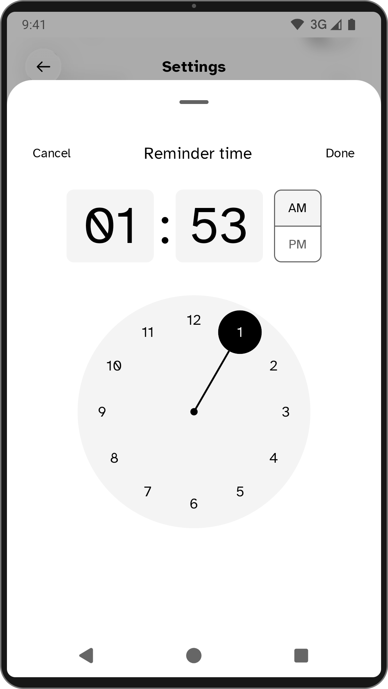</a><br/><sub>Reminder clock</sub></td>
<td align="center"><a href="play-store/screenshots/phone/07-image-sharing.png">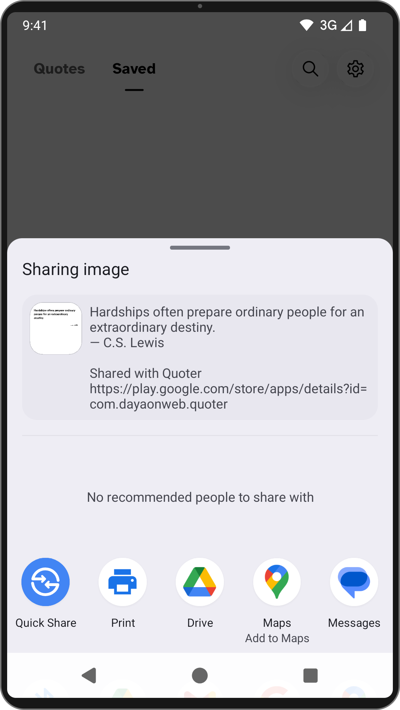</a><br/><sub>Image sharing</sub></td>
<td align="center"><a href="play-store/screenshots/phone/08-dark-reader.png">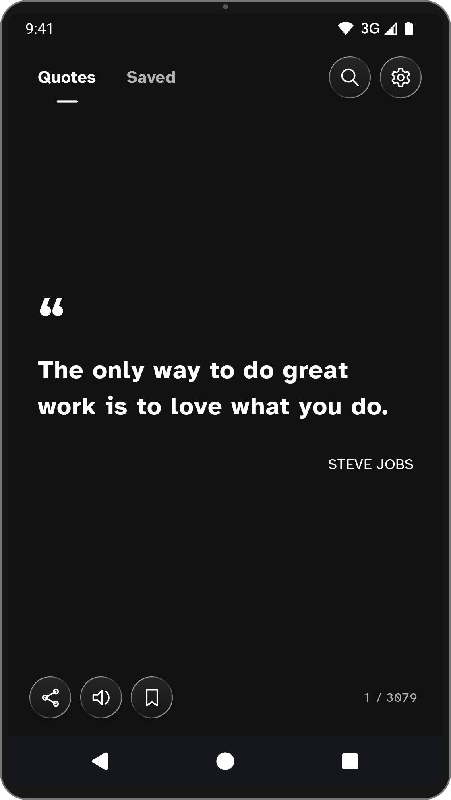</a><br/><sub>Dark reader</sub></td>
</tr>
</table>

</details>


<details>
<summary>Unfolded and tablet layouts</summary>

<table>
<tr>
<td align="center"><a href="play-store/screenshots/large-screen/01-unfolded-browse.png">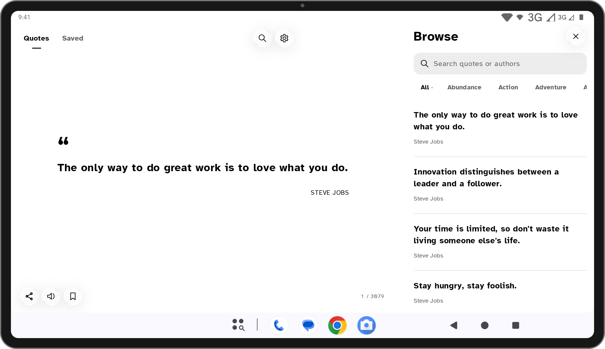</a><br/><sub>Browse</sub></td>
<td align="center"><a href="play-store/screenshots/large-screen/02-unfolded-settings.png">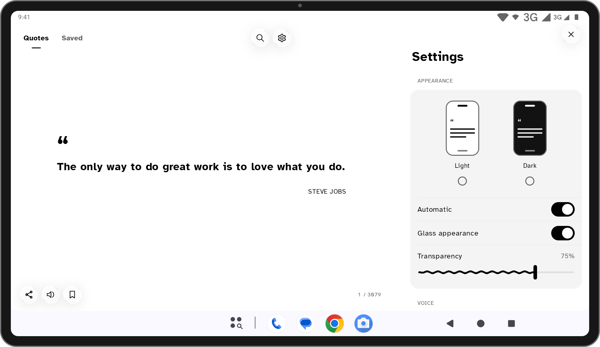</a><br/><sub>Settings</sub></td>
</tr>
<tr>
<td align="center"><a href="play-store/screenshots/large-screen/03-unfolded-saved.png">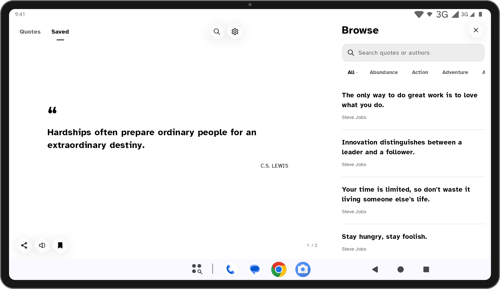</a><br/><sub>Saved</sub></td>
<td align="center"><a href="play-store/screenshots/large-screen/04-unfolded-dark.png">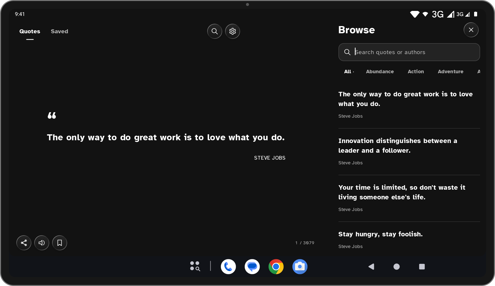</a><br/><sub>Dark</sub></td>
</tr>
</table>

</details>

<!-- QUOTER-SCREENSHOTS:END -->

Click a preview for the full capture. Frames are illustrative; all views use the
same screenshots prepared for the [Play listing](play-store/ASO-RESEARCH.md).

## Quickstart

Install JDK 17+, Android SDK platform 37 and the official Android CLI. Set
`JAVA_HOME` and `ANDROID_HOME`, then:

```sh
git clone https://github.com/Damercy/Quoter.git
cd Quoter
android info
./gradlew :app:assembleDebug :app:testDebugUnitTest :app:lintDebug
```

On Windows, use `./gradlew.bat`. On Unix, run `chmod +x gradlew` first.
Release credentials are unnecessary for development.

## Releases

[GitHub releases](https://github.com/Damercy/Quoter/releases/latest) include a signed
APK, Play bundle, crash mapping and SHA-256 checksums. The GitHub APK uses a
different certificate from Play-installed copies and cannot update them.
The 4.00.00 Play update is pending.

## Documentation

- [Contributing and agent guidance](AGENTS.md) · [CI guide](audit/CI.md)
- [Design direction](audit/DESIGN-DIRECTION.md) · [Validation](audit/MIGRATION-VALIDATION.md)
- [Release workflow](audit/RELEASE-WORKFLOW.md) · [Play setup](audit/PLAY-PUBLISHING-SETUP.md)
- [Quote sources and attribution](audit/QUOTE-SOURCES.md)

Report bugs or suggest improvements through [GitHub issues](https://github.com/Damercy/Quoter/issues).
This repository is licensed under [CC0 1.0](LICENSE); bundled dependencies and
quote sources retain their [respective notices](app/src/main/assets/licenses).
