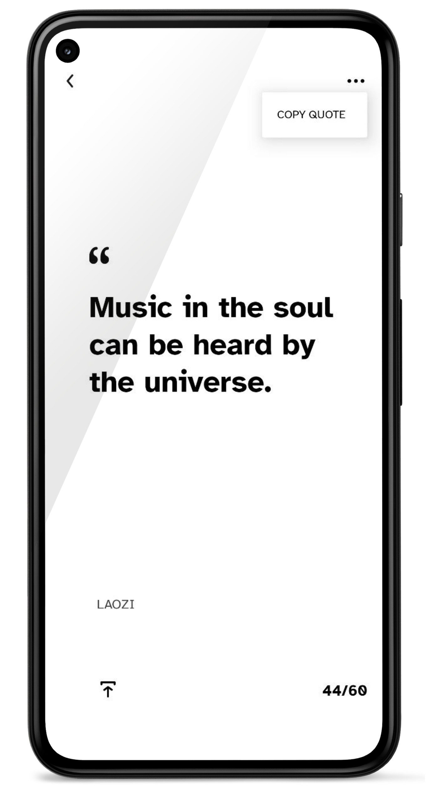

# Quoter
Browse &amp; copy quotes to share among your socials!

#### Features
- 🔊  Read aloud quotes using on-device Text-to-Speech engine.
- ©️  Copy quotes.
- 📱  Share quotes.
- 🖊️  Minimalist UI.
- 🔔  Set notifications at specified time to get quotes periodically.
- 🌚  Dark mode support.

 

Share feedback at: adhikaridayamoy@gmail.com.
